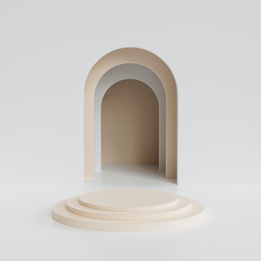

### portfolio

This website is mainly display all my creation from level 1 to level 2. The main page will display my intro and
my experience. After that reader can see some of my work in thumbnai when they hover it. The bottom part is for people who want to contact with me cant send me a message. 

The workpage is listing more information about each creation what I made. For the video people can see it directly see from website and web design also link to the actual page once audience click it.

## Challenges what I faced when I create this website

Building the bootstrap website on html at the first time. After I almost complete the html part, I start doing the 
css part.Turn out that I could not override the css stylesheet to my html. And also some header had been taken place as bg-warning color. After I searched on internet, I realized the stylesheet should be placed the last past in head.

Don't understand <button> tag in the begining. I used a lot of <a> tag to do the href link to link the other page or scorlling. Turn out that, I don't really need to use <button> tag. I use <a> tag and add bootsrap and icon, which look like a button.

In the index.html page, I was tring to do the popover effect on the Digital graphic part. After searching and serveral tring. The popover never come up, and also mess the layout. In order to make the effect I figure out to use the Adjact (+) in css. When view hover one element, one artwork thumbnail will popup under. Which is what I want exactly.  

# images
[title](https://www.pexels.com/) :	,	,	, 
The other picture create by myself or created from the last semester assignment.

# plugins,icon,font 
[title](https://getbootstrap.com/)

# layout, framework, libraries,video
create by myself
